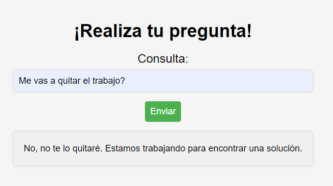

# Post_creator_app
## _Tu futuro amo_




[](https://media.licdn.com/dms/image/C4E12AQEegVv69D2cOg/article-cover_image-shrink_600_2000/0/1520133367755?e=2147483647&v=beta&t=KdnuCmKpFPY5lkXwAbLbHXmWAU-gIvbTqyVT6Vvzq5o)

[](https://github.com/Lean788/post_creator_app2)

Post_creator_app es una aplicación web habilitada en la nube, lista para móviles, compatible con almacenamiento en línea y desarrollada en Python y Flask que permite a los usuarios generar texto utilizando la API de GPT-3 de OpenAI y almacenar tanto la entrada del usuario como la salida generada en una base de datos MySQL alojada en AWS.

La aplicación también cuenta con una página de inicio que contiene un formulario donde los usuarios pueden enviar sus consultas y recibir respuestas generadas por GPT-3.
Para utilizar la aplicación, simplemente ingrese una pregunta o un enunciado en el campo de entrada y haga clic en "Enviar". La aplicación utilizará GPT-3 de OpenAI para generar una respuesta, que se mostrará en la página.

- Escriba su pregunta.
- Su respuesta en instantes!
- ✨Magia

## Features


- Generación de texto utilizando la API de GPT-3 de OpenAI
- Almacenamiento de la entrada del usuario y la respuesta generada en una base de datos MySQL alojada en AWS
- Página de inicio con formulario para enviar consultas y recibir respuestas generadas por GPT-3
- Arquitectura cliente-servidor utilizando Flask como servidor y el navegador web del usuario como cliente
- Utilización de la biblioteca Flask-MySQLdb para acceder a la base de datos MySQL
- Uso de un archivo. env para cargar las credenciales de la API de GPT-3 y la base de datos.


Como [Linus Torvalds] dijo una vez:

> El sofware es como el sexo, es mejor cuando es gratis.


Nuestra aplicación es completamente gratuita.

## Tecnologia

post_creator_app utiliza las siguientes bibliotecas y tecnologías de código abierto:


- [Flask]: Framework web para Python.
- [Flask-MySQLdb]: Extensión de Flask para MySQL.
- [mysqlclient]: Conector de MySQL para Python.
- [openai]: API para procesamiento de lenguaje natural.


Y por supuesto, post_creator_app en sí mismo es de código abierto con un [repo público] en GitHub.


## Instalación: 

Para utilizar nuestro proyecto, se requieren los siguientes requisitos:

- Docker (debe estar instalado en su máquina)
- Clonar el repositorio
- Primero, clone el repositorio de GitHub en su máquina local:
- bash
- git clone https://github.com/Lean788/post_creator_app2
- Crear y ejecutar el contenedor Docker


## Pasos
1.	Navegue hasta la carpeta del repositorio clonado:

•  ```cd tu_repositorio```.
•  Cree el contenedor Docker utilizando el archivo Dockerfile:
• ``` docker build -t "nombre_contenedor"``` .
Nota: Asegúrate de incluir el punto al final del comando para indicar la ubicación del Dockerfile.
•  Ejecute el contenedor Docker:

3.	```docker run -p 5000:5000 "nombre_contenedor"```
4.	Nota: El primer número "5000" representa el puerto de su máquina local, mientras que el segundo número "5000" representa el puerto dentro del contenedor Docker donde se ejecuta la aplicación Flask. Si su aplicación Flask utiliza otro puerto, asegúrese de actualizar estos valores.
Acceder a la aplicación
Ahora que el contenedor Docker se está ejecutando, puede acceder a la aplicación Flask en su navegador web en la dirección http://localhost:5000. Si todo funciona correctamente, debería ver la página de inicio de su aplicación.
Detener el contenedor Docker
Para detener el contenedor Docker, presione Ctrl + C en la línea de comando donde se está ejecutando el contenedor. También puede detener el contenedor utilizando el siguiente comando:
vbnet
```docker stop nombre_contenedor```


### Instalación y uso
##### Prerrequisitos
•	Docker (debe estar instalado en su máquina)
•   Clonar el repositorio
Primero, clone el repositorio de GitHub en su máquina local:
```git clone https://github.com/Lean788/post_creator_app2.git```
Crear y ejecutar el contenedor Docker
1.	Navegue hasta la carpeta del repositorio clonado:
.  ```cd tu_repositorio```
2.  Cree el contenedor Docker utilizando el archivo Dockerfile:
. ```docker build -t nombre_contenedor.```
Nota: Asegúrate de incluir el punto al final del comando para indicar la ubicación del Dockerfile.

3. Ejecutar contenedor, variables de entorno.

El comando Docker que se utiliza para ejecutar el contenedor de la aplicación Flask incluye variables de entorno que deben ser reemplazadas con las credenciales correspondientes de cada usuario. Estas variables son:

- ACCESS_KEY: Es la clave de acceso de la aplicación que se utiliza para la autenticación. Cada usuario debe reemplazar este valor con su propia clave de acceso.

- USERNAME_DB: Es el nombre de usuario de la base de datos utilizada por la aplicación. Cada usuario debe reemplazar este valor con su propio nombre de usuario.

- PASSWORD_DB: Es la contraseña de la base de datos utilizada por la aplicación. Cada usuario debe reemplazar este valor con su propia contraseña.

 - HOST_DB: Es la dirección del host de la base de datos utilizada por la aplicación. Cada usuario debe reemplazar este valor con la dirección de host correspondiente.


> A continuación se muestra un ejemplo del comando Docker con las variables de entorno reemplazadas por los valores correspondientes:

```docker run -d -t --name container_post_creator -p 5000:5000 -e "ACCESS_KEY=my_access_key" -e "USERNAME_DB=my_username" -e "PASSWORD_DB=my_password" -e "HOST_DB=mi_host" post_creator```

	docker run -d -t --name nombre_contenedor -p 5000:5000 -e "ACCESS_KEY=" -e "USERNAME_DB=" -e "PASSWORD_DB=" -e "HOST_DB=" nombre_imagen


> Nota: En este ejemplo, las variables de entorno han sido reemplazadas por los valores "my_access_key", "my_username", "my_password" y "mi_host". Cada usuario debe reemplazar estos valores con las credenciales correspondientes.

4. El primer número "5000" representa el puerto de su máquina local, mientras que el segundo número "5000" representa el puerto dentro del contenedor Docker donde se ejecuta la aplicación Flask. Si su aplicación Flask utiliza otro puerto, asegúrese de actualizar estos valores.
Junto a cada variable de entorno, es necesario adjuntar sus credenciales correspondientes(API key y la base de datos).


### Comprobaciones:
Una vez que se haya implementado cada uno de los pasos, si lo desea, puede llevar a cabo una comprobación del correcto funcionamiento del contenedor. Para ello, utilice este comando 
```docker ps```


### Acceder a la aplicación
Ahora que el contenedor Docker se está ejecutando, puede acceder a la aplicación Flask en su navegador web en la dirección http://localhost:5000. Si todo funciona correctamente, debería ver la página de inicio de su aplicación.


### Detener el contenedor Docker
Para detener el contenedor Docker, presione Ctrl + C en la línea de comando donde se está ejecutando el contenedor. También puede detener el contenedor utilizando el siguiente comando:
```docker stop nombre_contenedor```
¡Y eso es todo! Con estos pasos, deberías poder instalar y ejecutar tu aplicación Flask en Docker.


**Free Software, Hell Yeah!**

[//]: # (These are reference links used in the body of this note and get stripped out when the markdown processor does its job. There is no need to format nicely because it shouldn't be seen. Thanks SO - http://stackoverflow.com/questions/4823468/store-comments-in-markdown-syntax)

[aiohttp]: https://docs.aiohttp.org/en/stable/
[aiosignal]:https://pypi.org/project/aiosignal/
[async-timeout]:https://pypi.org/project/async-timeout/
[attrs]:https://www.attrs.org/en/stable/
[certifi]:https://pypi.org/project/certifi/
[charset-normalizer]:https://pypi.org/project/charset-normalizer/
[click]:https://click.palletsprojects.com/en/8.1.x/
[colorama]:https://recursospython.com/guias-y-manuales/colorama-texto-fondo-coloreados-la-consola/
[Flask]:https://flask.palletsprojects.com/en/2.2.x/
[Flask-MySQLdb]:https://flask-mysqldb.readthedocs.io/en/latest/
[frozenlist]:https://pypi.org/project/frozenlist/
[idna]:https://pypi.org/project/idna/
[importlib-metadata]:https://pypi.org/project/importlib-metadata/
[itsdangerous]:https://itsdangerous.palletsprojects.com/en/2.1.x/
[Jinja2]:https://jinja.palletsprojects.com/en/3.1.x/
[MarkupSafe]:https://pypi.org/project/MarkupSafe/
[multidict]:https://pypi.org/project/multidict/
[mysqlclient]:https://pypi.org/project/mysqlclient/
[openai]:https://openai.com/
[PyMySQL]:https://pypi.org/project/PyMySQL/
[python-dotenv]:https://pypi.org/project/python-dotenv/
[requests]:https://pypi.org/project/requests/
[tqdm]:https://github.com/tqdm/tqdm
[urllib3]:https://pypi.org/project/urllib3/
[Werkzeug]:https://werkzeug.palletsprojects.com/en/2.2.x/
[repo público]: https://github.com/Lean788/post_creator_app2
[Python 3]: https://www.python.org/downloads/release/python-3112/

   
   

   [PlDb]: <https://github.com/Lean788/post_creator_app2>
   [PlGh]: <https://github.com/Lean788/post_creator_app2>
   [PlGd]: <https://github.com/Lean788/post_creator_app2>
   [PlOd]: <https://github.com/Lean788/post_creator_app2>
   [PlMe]: <https://github.com/Lean788/post_creator_app2>
   [PlGa]: <https://github.com/Lean788/post_creator_app2>
